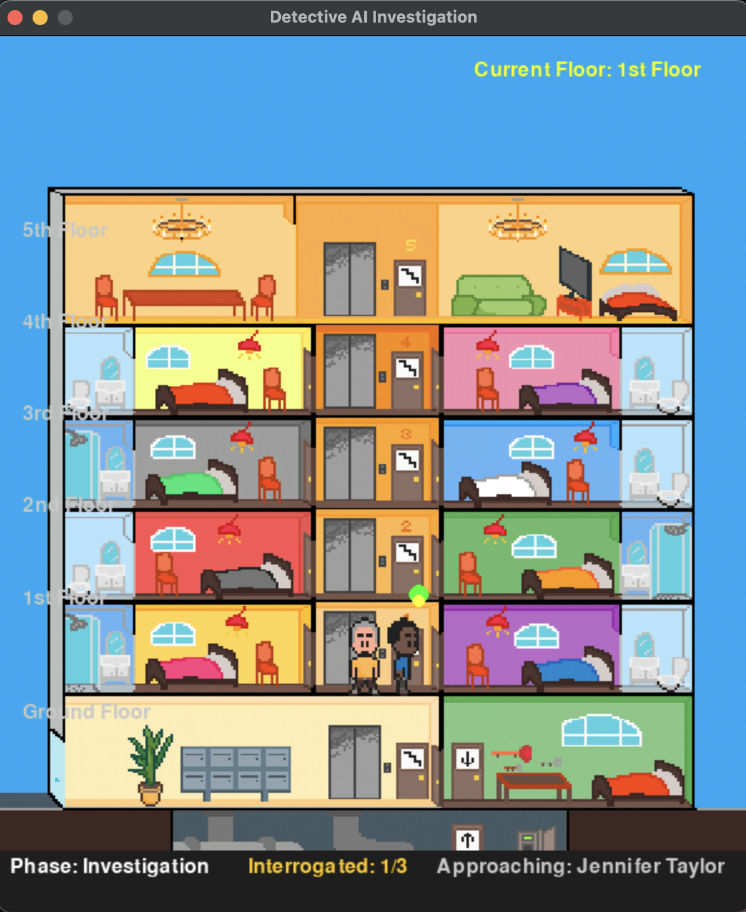

# AI Detective Game

<div align="center">
  
  <h3>An AI-powered detective investigation game</h3>
</div>

## Project Overview

This project is an interactive detective game that uses AI to investigate cases autonomously.

| Key Features | Description |
|--------------|-------------|
| 🔍 **Procedural Generation** | Unique cases with different crimes, suspects, and motives |
| 🤖 **AI Detective** | Autonomous agent that analyzes evidence and interrogates suspects |
| 🏢 **Multi-floor Building** | Visual environment with NPCs on different floors |
| 🛗 **Elevator System** | Detective navigates between floors to find suspects |
| 💬 **Interactive Dialogue** | Visualization of the interrogation process |
| 🧠 **Deduction System** | Step-by-step presentation of detective's reasoning |
| ✅ **Case Resolution** | Conclusion with confidence measurements |

## Project Team

- Mathieu Rio
- Arthur Bourdin
- Rémi Maigrot

## Project Structure

```ascii
┌─────────────────────┐       ┌─────────────────────┐
│  generate_and_play  │──────▶│    detective.py     │
│         .py         │       │  (AI Investigation) │
└─────────────────────┘       └─────────────────────┘
          │                              │
          │                              │
          ▼                              ▼
┌─────────────────────┐       ┌─────────────────────┐
│    create_plot.py   │       │     main.py         │
│  (Case Generation)  │       │  (Game Entry Point) │
└─────────────────────┘       └─────────────────────┘
          │                              │
          │                              │
          └──────────────┬──────────────┘
                         │
                         ▼
┌─────────────────────────────────────────────────────┐
│               detective_game.py                     │
│             (Game Visualization)                    │
└─────────────────────────────────────────────────────┘
          ┌──────────────┼──────────────┐
          │              │              │
          ▼              ▼              ▼
┌─────────────────┐ ┌──────────────┐ ┌─────────────────┐
│  assets.py      │ │movement_system│ │case_processor.py│
│ (Game Assets)   │ │     .py       │ │(Case Analysis)  │
└─────────────────┘ └──────────────┘ └─────────────────┘
          │              │              │
          └──────────────┼──────────────┘
                         │
                         ▼
                  ┌─────────────┐
                  │  utils.py   │
                  │ (Utilities) │
                  └─────────────┘
```

## Project File Structure

```
Practical-Assignment-Groups-8-Ethic/
├── case_history/                 # Stores generated case files
│   ├── case_1222.json
│   ├── case_1570.json
│   ├── case_4890.json
│   ├── case_7148.json
│   └── case_8256.json
│
├── content/                      # Game assets and resources
│   ├── ascenseur.wav             # Elevator sound effect
│   ├── game-background.png       # Main background image
│   ├── music.ogg                 # Background music
│   ├── sprt_player.png           # Detective sprite sheet
│   ├── neighbor1.png             # NPC sprites
│   ├── neighbor2.png
│   ├── neighbor3.png
│   ├── neighbor4.png
│   ├── neighbor5.png
│   └── ... (other UI and game assets)
│
├── src/                          # Source code
│   ├── assets.py                 # Asset loading and management
│   ├── case_processor.py         # Processes case data for visualization
│   ├── create_plot.py            # Mystery case generator
│   ├── detective.py              # AI detective algorithm
│   ├── detective_game.py         # Main game visualization
│   ├── movement_system.py        # Character movement and animations
│   ├── setup.py                  # Setup utilities
│   └── utils.py                  # General utility functions
│
├── main.py                       # Entry point for the game
└── README.md                     # Project documentation
```

## How to Run the Game

### From Existing Case File
```bash
python main.py
```
or
```bash
python main.py path/to/case_file.json
```

### Generate New Case and Play
```bash
python generate_and_play.py
```

## Game Controls

| Key | Action | Visual |
|-----|--------|--------|
| <kbd>SPACE</kbd> | Advance dialogue/deduction | ▶️ |
| <kbd>F</kbd> | Toggle fast mode | ⏩ |
| <kbd>H</kbd> | Show/hide help screen | ❓ |
| <kbd>ESC</kbd> | Exit game | 🚪 |

## AI Detective System

### AI Architecture Overview

```
┌───────────────────────────────────────────────────────────┐
│                  AI Detective System                      │
└───────────────────────────────────────────────────────────┘
                            │
       ┌───────────────────┼───────────────────┐
       │                   │                   │
       ▼                   ▼                   ▼
┌─────────────────┐ ┌─────────────────┐ ┌─────────────────┐
│  Rule-Based     │ │   Statistical   │ │   Behavioral    │
│  Reasoning      │ │   Analysis      │ │   Detection     │
└─────────────────┘ └─────────────────┘ └─────────────────┘
       │                   │                   │
       └───────────────────┼───────────────────┘
                           │
                           ▼
┌───────────────────────────────────────────────────────────┐
│                  Suspicion Scoring                        │
└───────────────────────────────────────────────────────────┘
                           │
                           ▼
┌───────────────────────────────────────────────────────────┐
│                  Confidence Assessment                    │
└───────────────────────────────────────────────────────────┘
                           │
                           ▼
┌───────────────────────────────────────────────────────────┐
│                  Culprit Identification                   │
└───────────────────────────────────────────────────────────┘
```

### Key AI Components

1. **Rule-Based Reasoning**

The detective uses logical rules to identify contradictions between statements:

```python
def find_contradictions(statements):
    contradictions = []
    # Check alibis against each other
    for name1, statement1 in statements.items():
        for name2, statement2 in statements.items():
            if name1 != name2:
                # Check if one suspect claims to have seen another at a time/place 
                # that contradicts their alibi
                if name2 in statement1.get('saw_other_suspects', {}):
                    sighting = statement1['saw_other_suspects'][name2]
                    if sighting['time'] == statement2['alibi_time'] and \
                       sighting['location'] != statement2['alibi_location']:
                        contradictions.append({
                            'type': 'alibi_contradiction',
                            'details': f"{name1} saw {name2} at {sighting['location']} during {sighting['time']}, " \
                                      f"but {name2} claims to be at {statement2['alibi_location']}"
                        })
    return contradictions
```

2. **Suspicion Scoring System**

| Factor | Weight | Example |
|--------|--------|---------|
| Contradiction | 1.5 | Suspect's alibi conflicts with witness |
| Nervous behavior | 0.8 | Suspect fidgets during interrogation |
| Deceptive behavior | 1.2 | Suspect avoids direct answers |
| Has motive | 1.0 | Money, revenge, etc. |
| Knowledge of evidence | 0.7 | Mentions detail only killer would know |

3. **Investigation Process Flowchart**

```
START
  │
  ▼
┌─────────────────────┐
│ Evidence Collection │
└─────────────────────┘
  │
  ▼
┌─────────────────────┐
│ Suspect Prioritizing│
└─────────────────────┘
  │
  ▼
┌─────────────────────┐
│   Interrogation     │◄─────┐
└─────────────────────┘      │
  │                          │
  ▼                          │
┌─────────────────────┐      │
│Contradiction Analysis│     │
└─────────────────────┘      │
  │                          │
  ▼                          │
┌─────────────────────┐      │
│Behavioral Assessment│      │
└─────────────────────┘      │
  │                          │
  ▼                          │
┌─────────────────────┐      │
│  Evidence Mapping   │      │
└─────────────────────┘      │
  │                          │
  ▼                          │
┌─────────────────────┐      │
│  Suspicion Update   │      │
└─────────────────────┘      │
  │                          │
  ▼                          │
┌─────────────────────┐      │
│ More Suspects?      │─Yes──┘
└─────────────────────┘
  │ No
  ▼
┌─────────────────────┐
│ Confidence Analysis │
└─────────────────────┘
  │
  ▼
┌─────────────────────┐
│ Culprit Identified  │
└─────────────────────┘
  │
  ▼
END
```

### Confidence Calculation

The detective's confidence in its conclusion is calculated as:

```
confidence = (0.5 * score_ratio) + (0.5 * contradiction_factor)
```

Where:
- `score_ratio` = Suspicion score of top suspect / Second highest suspicion score
- `contradiction_factor` = Number of contradictions found * 0.15 (capped at 1.0)

### Implementation Decision Matrix

| Approach | Strengths | Weaknesses | Our Decision |
|----------|-----------|------------|--------------|
| Rule-Based | ✅ Transparent | ❌ Rigid | ✅ **Primary system** |
| Machine Learning | ✅ Pattern recognition | ❌ Needs training data | ❌ Not implemented |
| Hybrid | ✅ Flexible | ❌ Complex | ✅ **Secondary system** |
| Probabilistic | ✅ Handles uncertainty | ❌ Tuning required | ✅ **For scoring** |
| Behavioral | ✅ Realistic | ❌ Hard to model | ✅ **For visualization** |

## Game Visualization Components

### Building Structure

```
                                    5th floor (y=168) ┌─────┐
                                                     │ NPC5 │
                                                     └─────┘

                                    4th floor (y=241) ┌─────┐
                                                     │ NPC4 │
                                                     └─────┘

                                    3rd floor (y=314) ┌─────┐
                                                     │ NPC3 │
                                                     └─────┘

                                    2nd floor (y=387) ┌─────┐
                                                     │ NPC2 │
                                                     └─────┘

                                    1st floor (y=461) ┌─────┐
                                                     │ NPC1 │
                                                     └─────┘

                                    Ground floor      ┌─────┐
                                    (y=552)          │ DET. │
                                                     └─────┘

       ◄───────────────────────────────┬────────────────────────────────►
                                       │
                                     ELEVATOR
                                   (x=243-287)
```

### Game Phases

| Phase | Description | Visual Representation |
|-------|-------------|------------------------|
| **Exploration** | Detective moves between floors to interrogate suspects | 🏢 🚶‍♂️ 🔍 |
| **Deduction** | Detective presents findings and reasoning | 🧠 📝 🔎 |
| **Conclusion** | Detective names culprit with confidence level | 👮 📣 🔒 |

### NPC Behavior Based on Guilt

The behavior of NPCs is visually affected by their guilt level:

| Guilt Level | Movement Speed | Jitter/Nervousness | Visual Behavior |
|-------------|----------------|---------------------|---------------|
| Low (0.1-0.3) | Normal | Minimal | Smooth, predictable |
| Medium (0.3-0.6) | Slightly faster | Moderate | Some random movements |
| High (0.6-1.0) | Fast | Significant | Erratic, unpredictable |

Code snippet showing this behavior:

```python
# Guilt affects speed and movement
speed_factor = 0.8 + (npc.get("guilt", 0.1) * 0.5)
jitter = npc.get("guilt", 0.1) * 2.0

# Add random movement for stressed NPCs
dx += random.uniform(-jitter, jitter)
dy += random.uniform(-jitter, jitter)
```

## Technical Implementation

### Game Engine Components

```
┌─────────────────────────────────────────────────────────────┐
│                        Pygame                               │
└─────────────────────────────────────────────────────────────┘
                              │
      ┌──────────────────────┼──────────────────────┐
      │                       │                      │
      ▼                       ▼                      ▼
┌────────────┐        ┌──────────────┐       ┌────────────────┐
│  Rendering │        │Input Handling│       │  Game Loop     │
└────────────┘        └──────────────┘       └────────────────┘
      │                       │                      │
      └───────────────────────┼──────────────────────┘
                              │
                              ▼
┌─────────────────────────────────────────────────────────────┐
│                      Game State                             │
└─────────────────────────────────────────────────────────────┘
      │                       │                      │
      ▼                       ▼                      ▼
┌────────────┐        ┌──────────────┐       ┌────────────────┐
│  Detective │        │    NPCs      │       │   Case Data    │
└────────────┘        └──────────────┘       └────────────────┘
```

### State Machine for Game Phases

```
┌───────────────┐
│  EXPLORATION  │
└───────────────┘
        │
        │ All suspects interrogated
        ▼
┌───────────────┐
│   DEDUCTION   │
└───────────────┘
        │
        │ All deductions presented
        ▼
┌───────────────┐
│  CONCLUSION   │
└───────────────┘
        │
        │ End of game
        ▼
┌───────────────┐
│     END       │
└───────────────┘
```

## Key Code Components

### Detective Game Class

The `DetectiveGame` class is the core of the visualization system:

```python
class DetectiveGame:
    def __init__(self):
        pygame.init()
        self.screen = pygame.display.set_mode((600, 700))
        pygame.display.set_caption("Detective AI Investigation")
        self.clock = pygame.time.Clock()
        # ... initialization of game states and systems
        
    def run(self, json_data):
        """Run game with specified case"""
        self.load_case(json_data)
        
        while self.running:
            self.handle_events()
            self.update()
            self.render()
            self.clock.tick(60)
        
        pygame.quit()
        return self.conclusion["correct"] if self.conclusion else False
```

### Autonomous Detective Movement

One of the key features is the detective's ability to move autonomously between floors to interrogate suspects:

```python
def move_detective_autonomously(self):
    """Move detective autonomously toward target"""
    player = self.images[self.player_id]
    
    # Fix Y position if needed
    expected_y = self.movement.floor_positions[player["floor"]]
    if abs(player["position"][1] - expected_y) > 2:
        player["position"] = (player["position"][0], expected_y)
    
    # Return to ground floor if no target or in deduction phase
    if not self.target_npc or self.game_phase == "deduction":
        if player["floor"] != 0:
            # Move toward elevator
            elevator_x = 265
            if abs(player["position"][0] - elevator_x) > 5:
                # ... movement logic ...
            else:
                # Go down one floor
                if pygame.time.get_ticks() - getattr(self, "last_floor_change", 0) > 1000:
                    self.movement.change_floor(player, -1)
                    self.last_floor_change = pygame.time.get_ticks()
        return
    
    # ... more movement logic ...
```

### Case Processing

The `CaseProcessor` handles the interrogation sequence, extracting dialogues from the JSON data:

```python
def get_next_dialogue(self):
    """Get next interrogation dialogue"""
    if not self.interrogation_phase:
        return None, None, None
    
    if self.current_suspect_idx >= len(self.suspects):
        self.interrogation_phase = False
        self.deduction_phase = True
        return None, None, None
    
    suspect = self.suspects[self.current_suspect_idx]
    suspect_name = suspect["name"]
    interrogation = self.case_data["case"]["statements"].get(suspect_name, {})
    
    # ... dialogue extraction logic ...
    
    return npc_id, current_question, current_answer
```

### Elevator System

The movement system handles the detective's ability to change floors using the elevator:

```python
def change_floor(self, entity, direction):
    new_floor = entity["floor"] + direction
    if 0 <= new_floor < len(self.floor_positions):
        entity["floor"] = new_floor
        entity["position"] = (entity["position"][0], self.floor_positions[entity["floor"]])
        if self.elevator_sound:
            self.elevator_sound.play()
```

## Getting Started

To run the game from source:

1. Clone the repository
2. Install requirements:
   ```bash
   pip install pygame
   ```
3. Run the game:
   ```bash
   python main.py
   ```

## Future Enhancements

| Feature | Description | Priority |
|---------|-------------|----------|
| Learning System | AI that improves from past cases | High |
| Complex Reasoning | Multi-step deductions | Medium |
| Relationship Analysis | Connection mapping between suspects | Medium |
| Adaptive Questioning | Dynamic question generation | High |
| Multiple Crime Types | More variety in case generation | Low |

## Assets

The graphical assets in the Content folder (excluding music) were created by Grainbox:
https://github.com/Grainbox